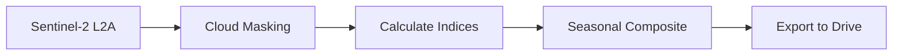

# Vegetation Indices Generator on GEE

Google Earth Engine script for generating seasonal vegetation indices and satellite imagery composites for agricultural monitoring and land cover analysis.

## 🌍 Project Overview

This script processes Sentinel-2 satellite imagery to create seasonal composites and vegetation indices for vegetation monitoring and semantic segmentation. It generates multi-band GeoTIFF exports suitable for machine learning-based land cover classification.

**Study Area**: Bureti, Kenya (customizable to any region)  
**Time Period**: 2023-2024 (customizable)  
**Seasons Analyzed**: Growing Season (March-May) and Picking Season (June-August)

### Sample Outputs

**NDVI Visualization** - Vegetation health gradient showing dense vegetation (green) to sparse/bare areas (red)


**Classified Land Cover** - Semantic segmentation results distinguishing different vegetation types


## 📊 Output Data Products

The script generates 16 GeoTIFF files per run:

### Vegetation Indices (4 files)
- NDVI (Normalized Difference Vegetation Index)
- EVI (Enhanced Vegetation Index)
- SAVI (Soil Adjusted Vegetation Index)
- NDWI (Normalized Difference Water Index)
- GNDVI (Green Normalized Difference Vegetation Index)
- NBR (Normalized Burn Ratio)

### RGB Composites (4 files)
True-color composites for visual reference and validation

### Sentinel-2 Bands (4 files)
All 10 spectral bands (B2-B8A, B11-B12) for deep learning applications

### Change Detection (2 files)
Seasonal difference images comparing Growing vs Picking seasons

## 🚀 Getting Started

### Prerequisites

- Google Earth Engine account ([sign up here](https://earthengine.google.com/))
- Study area shapefile uploaded as a GEE asset
- Basic understanding of JavaScript and remote sensing

### Installation

1. **Create a Google Earth Engine Account**
   - Visit [https://earthengine.google.com/](https://earthengine.google.com/)
   - Sign up with your Google account

2. **Upload Your Study Area**
   - In GEE Code Editor, go to **Assets** tab
   - Click **NEW** → **Shape files**
   - Upload your `.shp`, `.shx`, `.dbf`, `.prj` files
   - Note the asset path (e.g., `users/yourusername/Bureti_AOI`)

3. **Copy the Script**
   - Open the [GEE Code Editor](https://code.earthengine.google.com/)
   - Copy the script content
   - Replace the ROI path with your asset path

## 📝 Usage

### Basic Configuration

```javascript
// Update this line with your asset path
var roi = ee.FeatureCollection("users/yourusername/Bureti_AOI").geometry();
```

### Customize Seasonal Periods

Adjust date ranges based on your region's tea growing cycles:

```javascript
var simplifiedSeasons = [
  {
    name: '2023_Growing',
    start: '2023-03-01',  // Modify these dates
    end: '2023-05-31',     // based on local seasons
    description: '2023 Growing Season'
  },
  // ... more seasons
];
```

### Run the Script

1. Click **Run** button in GEE Code Editor
2. Check the **Console** for statistics and charts
3. View layer visualizations in the **Map** panel
4. Go to **Tasks** tab
5. Click **RUN** on each export task
6. Exports will be saved to Google Drive folder: `GEE_Vegetation_Indices`

## 📁 Output Files

### File Naming Convention

```
VegIndices_[Season]           # Vegetation indices
RGB_[Season]                  # RGB composites
S2Bands_[Season]              # Sentinel-2 bands
SeasonalDiff_[Year]          # Change detection
```

**Example**: `VegIndices_2023_Growing.tif`

### File Specifications

- **Format**: GeoTIFF
- **Coordinate System**: EPSG:4326 (WGS84)
- **Spatial Resolution**: 10 meters
- **Bands**: Multi-band (varies by product)

## 🔧 Parameters & Configuration

### Cloud Filtering

```javascript
.filter(ee.Filter.lt('CLOUDY_PIXEL_PERCENTAGE', 20))
```
Adjust the `20` value to be more/less strict with cloud coverage

### Spatial Resolution

```javascript
scale: 10  // 10-meter resolution
```
Options: 10m (detailed), 20m (faster), 30m (very fast)

### Export Region

The script automatically uses your uploaded shapefile boundary

## 📈 Data Processing Pipeline



1. **Image Collection**: Filters Sentinel-2 SR by date, bounds, and cloud cover
2. **Cloud Masking**: Uses QA60 band to remove clouds and cirrus
3. **Index Calculation**: Computes 6 vegetation indices
4. **Compositing**: Creates median composite for each season
5. **Export**: Generates GeoTIFF files for Google Drive

## 🎯 Use Cases

### 1. Semantic Segmentation
Use exported bands as training data for:
- Crop boundary detection
- Forest vs. agriculture classification
- Multi-class land cover mapping

### 2. Vegetation Health Monitoring
Analyze NDVI/EVI trends to identify:
- Stressed or underperforming areas
- Optimal harvesting times
- Irrigation needs

### 3. Change Detection
Compare seasonal differences to detect:
- Crop phenology patterns
- Land use changes
- Deforestation/afforestation

### 4. Time Series Analysis
Track vegetation indices over multiple seasons to:
- Model yield predictions
- Identify climate impacts
- Optimize land management

## 🗺️ Visualization Layers

The script adds these layers to the GEE Map:

| Layer | Description | Default Visibility |
|-------|-------------|-------------------|
| Study Area | Red boundary outline | On |
| 2023 Growing - NDVI | Vegetation health map | On |
| 2023 Growing - RGB | True-color composite | Off |
| 2023 Picking - NDVI | Post-harvest vegetation | Off |
| 2024 Growing - NDVI | Current season health | Off |
| 2024 Picking - NDVI | Latest picking season | Off |

**Tip**: Toggle layers on/off in the **Layers** panel to compare seasons

## 📊 Understanding Vegetation Indices

### NDVI (Normalized Difference Vegetation Index)
- **Range**: -1 to +1
- **Interpretation**:
  - < 0.2: Bare soil, rocks, water
  - 0.2 - 0.5: Sparse vegetation, grassland
  - 0.5 - 0.8: Dense vegetation (healthy crops)
  - > 0.8: Very dense vegetation (forests)

### EVI (Enhanced Vegetation Index)
- **Range**: -1 to +1
- **Advantage**: Better sensitivity in high-biomass areas
- **Use**: Preferred for dense crop plantations

### SAVI (Soil Adjusted Vegetation Index)
- **Range**: -1 to +1
- **Advantage**: Reduces soil background influence
- **Use**: Useful for areas with exposed soil between crops

### NDWI (Normalized Difference Water Index)
- **Range**: -1 to +1
- **Use**: Detects water stress in vegetation

## 🛠️ Troubleshooting

### Error: "roi is not defined"
**Solution**: Ensure you've replaced the asset path with your uploaded shapefile

### Error: "User memory limit exceeded"
**Solution**: Reduce study area size or increase `scale` parameter to 20 or 30

### Empty Exports / No Data
**Solution**: Check if your date ranges have sufficient cloud-free images
```javascript
// Add this to check image count
print('Image count:', s2.size());
```

### Exports Taking Too Long
**Solution**:
- Reduce spatial resolution: `scale: 20` instead of `10`
- Reduce cloud threshold: `CLOUDY_PIXEL_PERCENTAGE < 10`
- Split large areas into smaller tiles

## 📚 Resources

### Google Earth Engine
- [GEE Documentation](https://developers.google.com/earth-engine)
- [Sentinel-2 Data Description](https://developers.google.com/earth-engine/datasets/catalog/COPERNICUS_S2_SR_HARMONIZED)
- [GEE JavaScript Guide](https://developers.google.com/earth-engine/guides/getstarted)

### Remote Sensing
- [Understanding Vegetation Indices](https://gisgeography.com/ndvi-normalized-difference-vegetation-index/)
- [Sentinel-2 Band Combinations](https://giscrack.com/list-of-band-combinations-for-sentinel-2/)

### Agricultural Remote Sensing
- [Remote Sensing Applications](https://www.mdpi.com/journal/remotesensing/special_issues/agricultural_remote_sensing)

## 🤝 Contributing

Contributions are welcome! Please feel free to submit a Pull Request.

### Suggested Improvements
- [ ] Add monthly composites option
- [ ] Include texture analysis (GLCM)
- [ ] Add elevation/slope layers
- [ ] Implement automated cloud-free composite selection
- [ ] Create multi-year time series stacks

## 📄 License

This project is licensed under the MIT License - see the [LICENSE](LICENSE) file for details.

## ✍️ Citation

If you use this script in your research, please cite:

```bibtex
@software{vegetation_indices_gee,
  author = {Your Name},
  title = {Vegetation Indices Generator on GEE},
  year = {2024},
  publisher = {GitHub},
  url = {https://github.com/yourusername/vegetation-indices-gee}
}
```

## 👤 Author

**Your Name**
- Godwin Murithu
- Email: godwinm@orionterrametrics.co.ke

## 🙏 Acknowledgments

- Google Earth Engine team for providing the platform
- ESA/Copernicus for Sentinel-2 data
- Open source remote sensing community

## 📞 Support

For questions or issues:
1. Check the [Issues](https://github.com/yourusername/vegetation-indices-gee/issues) page
2. Create a new issue with:
   - Error message
   - Study area size
   - Date range used
   - Expected vs actual behavior

---

**Last Updated**: December 2024  
**GEE Script Version**: 1.0  
**Sentinel-2 Collection**: COPERNICUS/S2_SR_HARMONIZED
